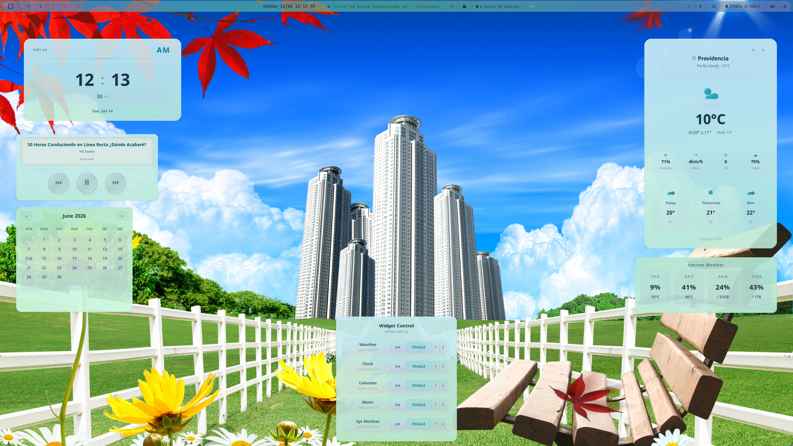
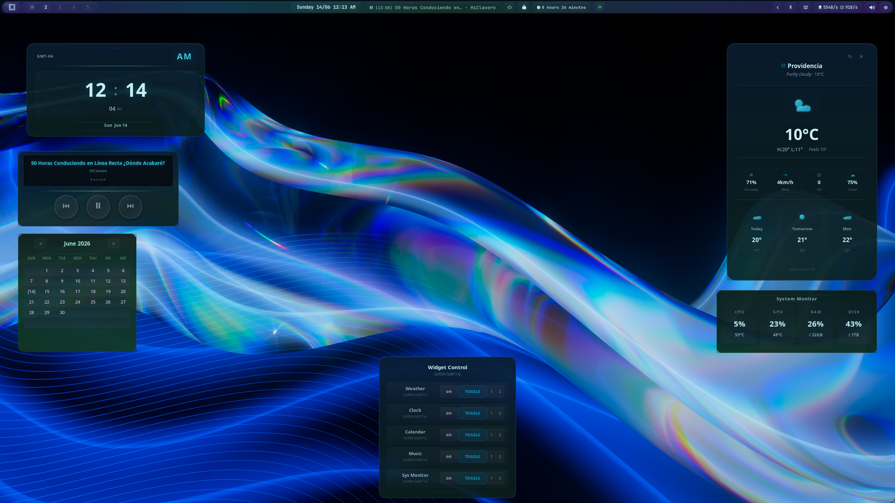
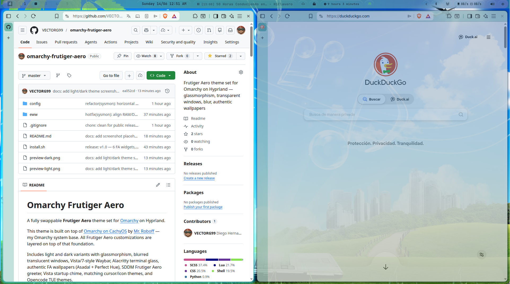
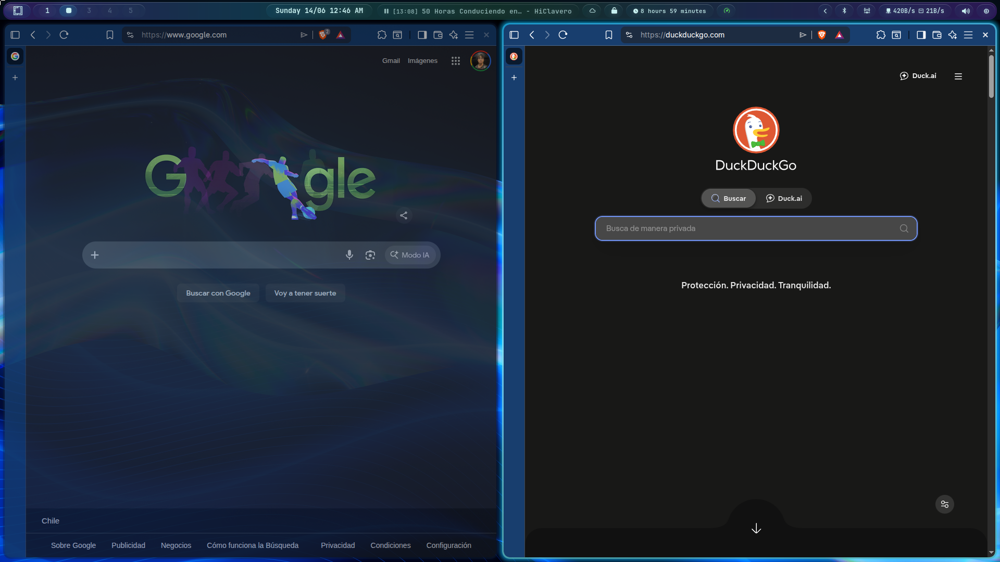

<div align="center">

# 🪟 Omarchy Frutiger Aero

### A fully swappable Frutiger Aero theme set for Omarchy on Hyprland

[](LICENSE)
[](https://github.com/VECTORG99/omarchy-frutiger-aero/stargazers)
[](https://github.com/VECTORG99/omarchy-frutiger-aero/issues)
[](https://hyprland.org)
[](https://github.com/anomalyco/omarchy)

**Glassmorphism · Translucent windows · Vista/7-style Waybar · Authentic FA wallpapers · 7 EWW desktop widgets**

Light & dark variants — swappable via `omarchy theme set` — one-command install




</div>

---

A fully swappable **Frutiger Aero** theme set for [Omarchy](https://github.com/anomalyco/omarchy) on Hyprland.

This theme is built on top of [Omarchy on CachyOS](https://github.com/roboff/omarchy-on-cachyos) by [Mr. Roboff](https://github.com/roboff) — my Omarchy system base. All Frutiger Aero customizations are layered on top of that foundation.

Includes light and dark variants with glassmorphism, blurred translucent windows, Vista/7-style Waybar, Alacritty terminal glass, authentic FA wallpapers (Asadal + Perfect Hue), Vista startup chime (optional, see [Issue #11](https://github.com/VECTORG99/omarchy-frutiger-aero/issues/11)), matching cursor/icon themes, and Opencode TUI themes.

Both themes are fully swappable via `omarchy theme set` — includes preview images for the theme switcher UI. One-command install with `install.sh`.

## ✨ Features at a glance

| Feature | Light | Dark |
|---------|-------|------|
| **Glassmorphism** | Teal `#5AACA0` bg, 40% opacity | Navy `#0A1A2E` bg, 85% opacity |
| **Waybar** | Vista/7 pill bar with FA gradient | Same + glow on hover |
| **Window borders** | 3-color gradient (teal → cyan → aqua) | Same + 72% inactive opacity |
| **Lockscreen** | Rounded input, teal glow, live clock | Same |
| **Terminal** | Alacritty 85% opacity, JetBrains Mono | Same |
| **Widgets** | 7 EWW widgets (weather, clock, music…) | Same |
| **Wallpapers** | 14 authentic FA wallpapers (Asadal + Perfect Hue) | 14 more dark variants |
| **Startup sound** | Optional Vista chime (bring your own `.wav`) | Same |

## Preview

| Light (`frutiger-aero`) | Dark (`frutiger-aero-dark`) |
|------------------------|-----------------------------|
|  |  |
| Teal `#5AACA0` bg, `#1A3344` fg | Navy `#0A1A2E` bg, `#C8F0F0` fg |
| Medium saturated teal + dark text | Deep navy + light teal text |

### Glass transparency

| Light | Dark |
|-------|------|
|  |  |

### Light palette

| Token | Color | Hex |
|-------|-------|-----|
| Background | Medium teal | `#5AACA0` |
| Foreground | Dark navy | `#1A3344` |
| Accent | Blue | `#1299CA` |
| Yellow (ANSI 3) | Amber | `#A08020` |
| Comments | Dark blue-gray | `#1A3A48` |

### Dark palette

| Token | Color | Hex |
|-------|-------|-----|
| Background | Deep navy | `#0A1A2E` |
| Foreground | Light teal | `#C8F0F0` |
| Accent | Cyan-blue | `#35BCDE` |

## Visual features

### Waybar (Vista/7-style pill bar)

- **Height**: 36px (auto-expands to 39px min with margin)
- **Background**: Translucent teal at 40% opacity with FA decorative gradient overlay (purple → blue → green → blue → purple)
- **Shape**: Pill modules with `border-radius: 14px`, individual glass gradient backgrounds with white shine (`inset 0 1px 0`)
- **Hover**: Glow effect on all modules (box-shadow + brighter gradient)
- **Workspaces**: Pulse animation (`orb-pulse` 3s) on occupied workspaces
- **Start button**: Radial-gradient omarchy icon on left
- **Bar decorative**: FA bubble gradient visible through translucent background

**Modules:**
- `custom/omarchy` — Start menu button
- `hyprland/workspaces` — Workspace indicators with pulse
- `custom/clock` — Custom script (12h, English locale, AM/PM) horizontal + vertical
- `mpris` — Media player with player-icons (Spotify , mpv/vlc , Firefox ), position via `{dynamic}`
- `idle_inhibitor` — Toggle idle (lock/unlock icons, green glow when active)
- `custom/weather` — Current weather
- `custom/update` — Package update indicator
- `custom/uptime` — System uptime
- `custom/power-profile` — Cycle power modes (power-saver/balanced/performance)
- `custom/network-speed` — Download/upload via `/proc/net/dev`
- `custom/voxtype` — Voice recording/transcription indicator
- `custom/screenrecording-indicator` — Screen recording status
- `custom/notification-silencing-indicator` — DND toggle
- `tray`, `bluetooth`, `network`, `pulseaudio`, `cpu`, `battery` — System indicators

### Hyprland

- **Border**: 3px width, `rounding_power: 2.5`
- **Active window**: 3-color gradient border (teal → cyan → aqua)
- **Inactive windows**: `opacity 0.72` with blur
- **Shadow**: Teal glow, `range: 14`
- **Animations**: `faBounce` custom bezier curve for windows
- **Workspaces**: Slide animation
- **Layer blur**: Enabled for mako notifications

### Hyprlock (lockscreen)

- **Frutiger Aero redesign**: Rounded input field (16px radius) with teal glow shadow
- **Live clock/date**: Middle of screen
- **"Welcome back"**: Greeting above input
- **Blur**: 4 passes, size 12, over current wallpaper

### Hypridle

- 5min → Brightness 10%
- 10min → Lock screen
- 15min → DPMS off
- 20min → Suspend

### Alacritty (terminal)

- **Opacity**: 85% (wallpaper shows through)
- **Font**: JetBrainsMono Nerd Font 10.5px
- **Theme**: Imports omarchy active theme colors

### Opencode TUI

| Theme | Background | Text |
|-------|-----------|------|
| `frutiger-aero` | Dark navy `#0A1A2E` | Light teal `#C8F0F0` |
| `frutiger-aero-light` | Light teal `#5AACA0` | Dark navy `#1A3344` |

### Startup sound

Vista startup chime plays 2s after login via `paplay --volume=45000` (autostart.lua). The `.wav` file is **not included** in the repo (copyright concerns) — place it at `~/.config/omarchy/sounds/vista-startup.wav` to enable. The autostart script skips silently if the file is missing.

### Icons & Cursors

- **Icons**: Yaru-prussiangreen (dark teal-green glossy, Frutiger Aero match)
- **Cursor**: Bibata-Modern-Ice (ice blue glass)

### Fonts

- **System**: [Fira Sans](https://fonts.google.com/specimen/Fira+Sans) 10px
- **Terminal/editor**: [JetBrains Mono Nerd Font](https://www.nerdfonts.com/font-downloads)
- **Fontconfig**: `hintslight`, `rgba=rgb`, `lcdfilter=default`

### Fastfetch

- Modified `keyColor` from `magenta` to `yellow` for contrast on teal backgrounds

### Wallpapers

3 authentic Frutiger Aero wallpapers per variant (6 total), bundled in the repo:

| Variant | Source | Files | Resolution |
|---------|--------|-------|------------|
| Light | Asadal, Perfect Hue | `fa-asadal-104.jpg`, `perfect-hue-1.jpg`, `perfect-hue-5.jpg` | 3000×2200 – 3840×2160 |
| Dark | Asadal, Perfect Hue | `fa-asadal-28.jpg`, `perfect-hue-3.jpg`, `perfect-hue-4.jpg` | 3440×1440 – 4000×2000 |

Wallpapers are in `backgrounds/` (light, repo root) and `config/omarchy/themes/frutiger-aero-dark/backgrounds/` (dark). Active wallpaper set via `~/.config/omarchy/current/background` symlink; cycle with `omarchy theme bg next`.

## What's included

```
# Light theme files at the repo root (installable via `omarchy theme install`)
colors.toml                 # Palette (accent, bg, fg, color0-15)
hyprlock.conf               # Lockscreen colors
icons.theme                 # Icon theme name
light.mode                  # Prefer-light mode marker
mako.ini                    # Notification styling
preview.png                 # Theme switcher preview
preview-unlock.png          # Lockscreen preview
swayosd.css                 # OSD styling
unlock.png                  # Unlock screen asset
walker.css                  # App launcher styling
waybar.css                  # Bar color variables

config/
├── hypr/
│   ├── hyprland.lua        # WM configuration
│   ├── hyprlock.conf        # Lockscreen
│   ├── hypridle.conf        # Idle daemon
│   ├── looknfeel.lua        # Visual (borders, shadows, blur, cursor)
│   ├── monitors.lua         # Display layout
│   ├── input.lua            # Input devices
│   ├── bindings.lua         # Keybindings
│   └── autostart.lua        # Auto-start programs + startup sound
├── waybar/
│   ├── config.jsonc         # Module layout
│   ├── style.css            # Frutiger Aero styles
│   └── scripts/
│       ├── clock.sh         # Custom clock (12h, English)
│       ├── uptime.sh        # System uptime
│       ├── power-profile.sh # Power mode cycling
│       ├── audio-eq.sh      # Unicode audio visualizer
│       └── network-speed.sh # Network speed monitor
├── alacritty/
│   └── alacritty.toml       # 85% opacity terminal
├── fontconfig/
│   └── fonts.conf           # Fira Sans, hinting
├── gtk/
│   └── settings.ini         # GTK icon/cursor theme
├── opencode/
│   ├── tui.json             # TUI config
│   └── themes/
│       ├── frutiger-aero.json
│       └── frutiger-aero-light.json
├── helix/
│   └── config.toml          # Editor colors
├── fastfetch/
│   └── config.jsonc         # System info display
└── omarchy/
    ├── themes/
    │   └── frutiger-aero-dark/  # Dark theme (full install only)
    └── hooks/
        └── theme-set.d/opencode-theme

eww/                        # 7 desktop widgets (weather, clock, music…)
install.sh                  # Full installer (both variants + global configs)
```

## Installation

### Theme only (light variant)

Install just the light theme via Omarchy's built-in installer — this is the
route listed on the [extra themes page](https://manuals.omamix.org/2/the-omarchy-manual/90/extra-themes):

```bash
omarchy theme install https://github.com/VECTORG99/omarchy-frutiger-aero
```

This clones the repo to `~/.config/omarchy/themes/frutiger-aero` and applies it.
The light theme files live at the repo root so `omarchy-theme-set` picks them up
correctly. The dark variant and the global configs (Waybar, Hyprland, EWW
widgets, etc.) are **not** installed by this route — use the full installer below
for those.

### Full install (recommended)

Clones the repo and runs `install.sh`, which installs both theme variants plus
all global configs, EWW widgets, hooks, and wallpapers:

```bash
git clone https://github.com/VECTORG99/omarchy-frutiger-aero.git
cd omarchy-frutiger-aero
./install.sh
```

### Manual install

```bash
# Clone
git clone https://github.com/VECTORG99/omarchy-frutiger-aero.git
cd omarchy-frutiger-aero

# Global configs
cp config/waybar/*.css ~/.config/waybar/
cp config/waybar/*.jsonc ~/.config/waybar/
cp -r config/waybar/scripts ~/.config/waybar/
cp config/hypr/* ~/.config/hypr/
cp config/alacritty/* ~/.config/alacritty/
cp config/opencode/* ~/.config/opencode/
cp -r config/opencode/themes ~/.config/opencode/
cp config/helix/* ~/.config/helix/
cp config/gtk/* ~/.config/gtk-3.0/
cp config/fontconfig/* ~/.config/fontconfig/
cp config/fastfetch/* ~/.config/fastfetch/

# Light theme files live at the repo root (swappable via omarchy theme set)
mkdir -p ~/.config/omarchy/themes/frutiger-aero
cp colors.toml hyprlock.conf icons.theme light.mode mako.ini \
   preview.png preview-unlock.png swayosd.css unlock.png walker.css waybar.css \
   ~/.config/omarchy/themes/frutiger-aero/

# Dark theme files stay under config/
cp -r config/omarchy/themes/frutiger-aero-dark ~/.config/omarchy/themes/

# Hooks (auto-switch opencode theme on theme change)
mkdir -p ~/.config/omarchy/hooks/theme-set.d
cp config/omarchy/hooks/theme-set.d/opencode-theme ~/.config/omarchy/hooks/theme-set.d/
chmod +x ~/.config/omarchy/hooks/theme-set.d/opencode-theme

# Apply
omarchy theme set "Frutiger Aero"
hyprctl reload
pkill waybar && waybar
```

## EWW Widgets

Seven Frutiger Aero desktop widgets built with [EWW](https://github.com/elkowar/eww) 0.5+:

| Widget | Keybind | Description |
|--------|---------|-------------|
| **Weather** | `SUPER+SHIFT+T` | Auto-location forecast via wttr.in, 3-day outlook, glass-minimal SVG icons |
| **Clock** | `SUPER+SHIFT+K` | 12h digital clock with date, timezone, glossy separators |
| **Calendar** | `SUPER+SHIFT+L` | Monthly calendar with `< >` navigation, today marked `[day]` |
| **Music** | `SUPER+SHIFT+R` | Now playing via playerctl, Pioneer car stereo style, LCD display |
| **System Monitor** | `SUPER+SHIFT+U` | CPU/GPU/RAM/DISK with rounded percentages and temps |
| **Opacity** | `SUPER+SHIFT+V` | Slider to control inactive window opacity (0-100%), presets, persists across reloads |
| **Control** | `SUPER+SHIFT+Q` | Toggle any widget on/off, per-widget screen selector [1][2], shows status and keybinds |

All widgets support light/dark themes via `omarchy theme set`.

### Widget dependencies
```
eww 0.5+  playerctl  python3  curl  nvidia-smi  lm-sensors  pulseaudio/pipewire
```

## Contributing

Contributions are welcome! Please read [CONTRIBUTING.md](docs/CONTRIBUTING.md) for guidelines on PRs, code style, and testing.

### Quick start for contributors

```bash
git clone https://github.com/VECTORG99/omarchy-frutiger-aero.git
cd omarchy-frutiger-aero
git checkout -B feat/your-feature origin/master
# make changes
shellcheck config/waybar/scripts/*.sh eww/scripts/*.sh install.sh
luac -p config/hypr/*.lua
git push -u origin feat/your-feature
gh pr create
```

### Testing commands

| Command | What it checks |
|---------|---------------|
| `shellcheck config/waybar/scripts/*.sh eww/scripts/*.sh install.sh` | Bash scripts |
| `luac -p config/hypr/*.lua config/omarchy/themes/*/*.lua` | Lua syntax |
| `jq . config/waybar/config.jsonc` | Waybar JSON |
| `bash -n install.sh` | Install script syntax |

## Acknowledgements

- **[Omarchy](https://github.com/anomalyco/omarchy)** — the Hyprland meta-distribution this theme is built for
- **[Omarchy on CachyOS](https://github.com/roboff/omarchy-on-cachyos)** by [Mr. Roboff](https://github.com/roboff) — system base
- **[EWW](https://github.com/elkowar/eww)** — ElKowar's Wacky Widgets for desktop widgets
- **[Asadal](https://www.asadal.com)** and **Perfect Hue** — original Frutiger Aero wallpapers
- **Frutiger Aero community** — for keeping the aesthetic alive since 2007

## License

[MIT](LICENSE) — Copyright (c) 2026 Diego Hernandez

### Wallpaper credits

The bundled wallpapers in `backgrounds/` are sourced from publicly available Frutiger Aero wallpaper collections by [Asadal](https://www.asadal.com) and Perfect Hue. They are included for personal desktop use with this theme. If you are the rights holder and believe any image should not be redistributed here, open an issue and it will be removed promptly.
